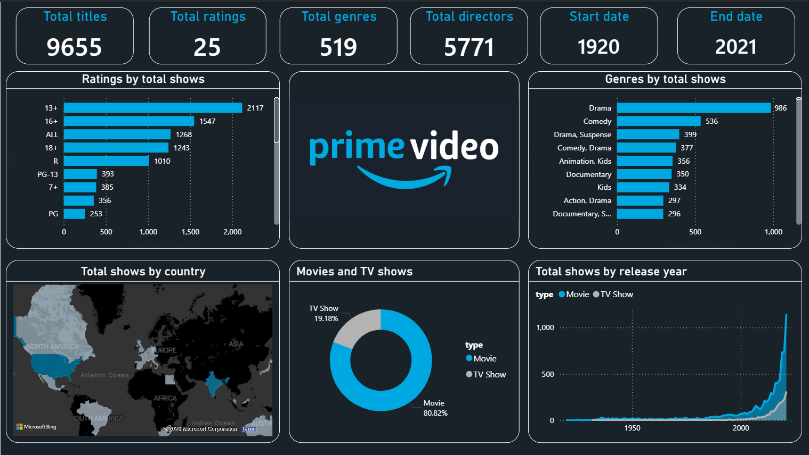

# 📊 Prime Video Power BI Dashboard

## 📌 Project Overview
This project presents an interactive Power BI dashboard analyzing Prime Video content data.  
The objective is to uncover content trends, ratings distribution, genre dominance, country-wise availability, and release patterns over time.

The dashboard transforms raw data into meaningful business insights using KPI metrics and dynamic visualizations.

---

## 🎯 Business Objectives

- Evaluate overall content volume on the platform
- Analyze ratings distribution across titles
- Identify top-performing genres
- Understand country-wise content availability
- Compare Movies vs TV Shows distribution
- Examine content growth trends over time

---

## 📷 Dashboard Preview

---

## 📂 Dataset Overview

The dataset includes Prime Video titles containing information about content type, ratings, genres, countries, and release years.

The data was cleaned and transformed in Power BI to ensure accurate KPI reporting and reliable trend analysis.

---

## 📊 Key KPIs

- **Total Titles:** 9,655  
- **Total Rating Categories:** 25  
- **Total Genres:** 519  
- **Total Directors:** 5,771  
- **Content Timeline:** 1920 – 2021  

---

## 📈 Key Insights

### 🔹 Content Type Distribution
- Movies dominate the platform (~80%)
- TV Shows account for ~20% of total content

### 🔹 Ratings Analysis
- Majority of content falls under 13+ and 16+ categories
- Strong presence of both teen and mature audience content

### 🔹 Genre Trends
- Drama is the most common genre
- Comedy and Drama combinations are highly popular
- Documentary and Kids categories show consistent presence

### 🔹 Country Distribution
- United States contributes the highest number of titles
- India and European countries show significant representation

### 🔹 Release Trends
- Gradual growth before 2000
- Sharp increase in content releases after 2015

---

## 🛠️ Tools & Technologies Used

- Power BI
- Data Cleaning & Transformation
- Data Modeling
- DAX (Data Analysis Expressions)
- Business Intelligence Reporting

---

## 🚀 Skills Demonstrated

- Exploratory Data Analysis (EDA)
- KPI Design & Development
- Interactive Dashboard Creation
- Business Insight Communication
- Data Visualization Best Practices

---

## 📌 Conclusion

This project demonstrates how business intelligence tools like Power BI can convert streaming platform datasets into actionable insights.  
The dashboard highlights content strategy patterns, audience targeting trends, and overall platform growth.
